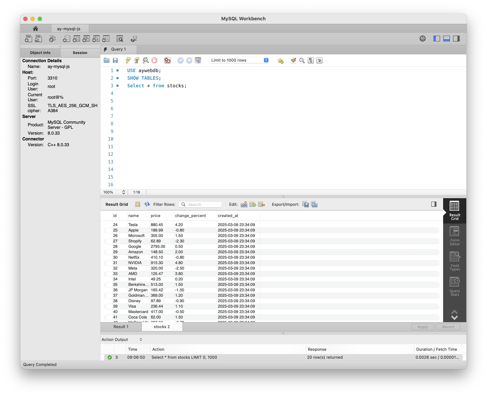
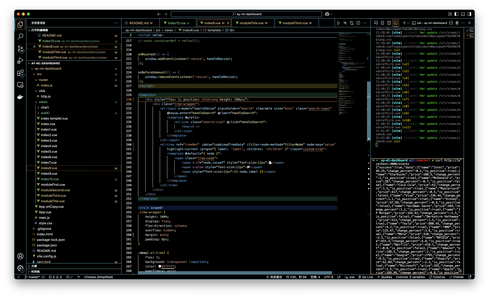
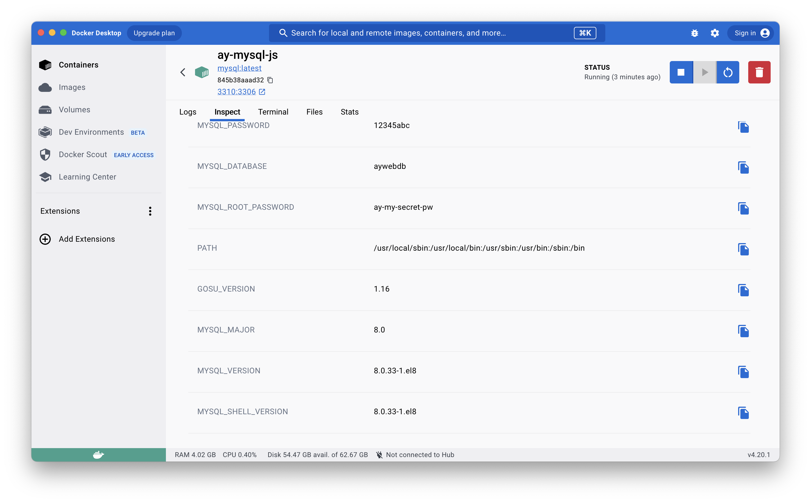
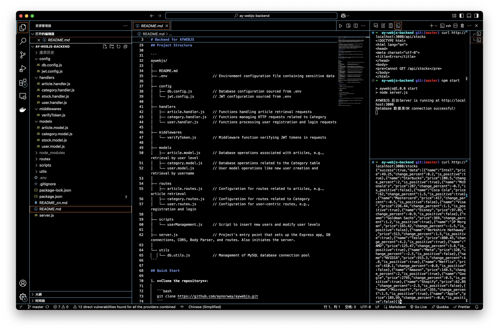

# Data Visualization Dashboard (Full-Stack)

 

## The ay-ml-dashboard Project 
This is a full-stack dashboard that turns complex data into clear visual stories. The frontend uses Vue3 with DataV / ECharts to create interactive charts, while the backend (Node.js + MySQL) and Docker handles data storage and processing.  Designed to show full-stack development skills, with a flexible structure that lets teams easily add new data sources or chart types.

 

## Repository Links
- Frontend: [https://github.com/aynorway/ay-ml-dashboard](https://github.com/aynorway/ay-ml-dashboard)
- Backend: [https://github.com/aynorway/ay-webjs-backend](https://github.com/aynorway/ay-webjs-backend)

## Technology Stack

### Frontend
- **Framework**: Vue3 
- **Visualization**: DataV + ECharts + GeoJSON
- **Routing**: Vue Router4
- **HTTP Client**: Fetch API
- **UI**: Element Plus
- **Build Tool**: Vite

### Backend
- **Runtime**: Node.js18+
- **Web Framework**: Express
- **Database**: MySQL 8 (Docker)
- **API Style**: RESTful

### DevOps
- **Database Management**: MySQL Workbench
- **Containerization**: Docker
- **API Testing**: curl 
- **Version Control**: Git


## Features
### Visualization Modules
- Real-time stock price dashboard
- Interactive charts (Bar/Line/Pie/Rader)
- GeoJSON-based geographic visualization
- Responsive layout for multiple screen sizes
- Component reuse with Vue props


## System Architecture
```
ay-ml-dashboard/ (Frontend)
├── src/
│   ├── components/    # Reusable visualization components
│   ├── assets/        # GeoJSON/Images
│   ├── utils/         # ECharts configurations
│   └── api/           # Axios endpoints

aywebjs/ (Backend)
├── models/            # Data models
├── routes/            # API endpoints
├── handlers/          # Business logic
└── config/            # DB/JWT configurations
```

## Database Management
### MySQL Workbench 
 

## Installation
### Prerequisites
- Node.js 18+
- Docker
- MySQL Workbench

### Frontend Setup
```bash
cd ay-ml-dashboard
npm install
npm run dev
```
 

### Backend Setup
Start MySQL container:



.env in backend

Initialize backend:
```bash
cd aywebjs
npm install
npm start
```

 


## Architecture Diagram：
graph LR
    A[Frontend:8088] -->|API Calls| B[Backend:3000]
    B -->|MySQL Protocol| C[(MySQL:3310:3306)]

## License
MIT License
